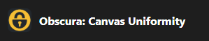
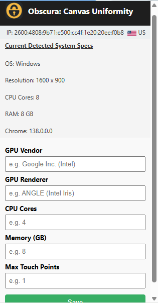

<h1 align="center">Canvas Uniformity & Browser Fingerprint Spoofing</h1>
<h2 align="center">(Chrome Extension)</h2>

<br>
<p align="center">

</p>

💡  **Manually Control your Browser Fingerprint:** Enhance your Browser Privacy, and **Create Stealthy Virtual Machines** with advanced canvas control, and system-level transparency. Obscura helps reduce data leaks by allowing you to deliberately align your environment with standard browser characteristics—no tracking, no randomness, just consistency.

<br>

<p align="center">


</p>

## 🔍 Summary: 
**Obscura: Canvas Uniformity is a Chrome Extension and browser fingerprint hardening tool** focused on deterministic fingerprint spoofing, not randomization. Unlike most canvas privacy tools—which rely on canvas poisoning (randomizing values per session or per site)—Obscura
enforces a uniform and stable fingerprint across sessions, devices, and domains. In other words, unlike most anti-fingerprinting tools that aim for evasion through noise. Obscura aims for camouflage through control.

**Canvas Poisoning** (e.g., Brave Browser, Tor Browser) works by
introducing entropy into the fingerprint surface. This is valuable for
pure privacy because it prevents tracking across sessions.

**Canvas Uniformity**, works by spoofing canvas
output with fixed, user-defined values, ensuring your fingerprint looks
consistent and deliberate, but never real.

🛡️ You can appear as a stable identity, not a chaotic or rotating one

🎯 Ideal for Red Team simulations, bot development, penetration testing,
or controlled fingerprint spoofing

👤 Still useful for privacy, especially if you want to impersonate a
common browser profile rather than stand out as “random”

## ⚙️ How Obscura Works:

Obscura injects JavaScript into every page context, using browser APIs like getImageData(), toDataURL(), and getContext() to override and spoof the outputs of HTML canvas rendering.
Your configuration (set via config.html) determines how canvas fingerprinting attempts are handled. Injected values are deterministic (defined by you). Obscura ensures the spoof is applied before page scripts execute. 
CSP bypass (Chrome Security Policy) enables injection on 95% of websites

📛 Masks canvas getImageData() and toDataURL() output

⚙️ Offers full control through a local config panel

🧱 Optional CSP bypass for locked-down environments

🧪 Designed for privacy lab testing, pen testing, and educational use

<p align="center">

</p>

## 🚀 Installation 

To install Obscura in Chrome or any Chromium-based browser:

**Step 1:** Download the repository ZIP file here: https://github.com/Nathaniel-Coulter/Obscura-Canvas-Uniformity/raw/main/Obscura-Chrome.zip 
(Then click the on the arrow and select “Download ZIP” , if isn't downloaded automatically.)

**Step 2:** Extract the ZIP Unzip the contents into a folder on your desktop or another easy-to-access location. (Left Click -> Extract) 

**Step 3:** Open Chrome and navigate to **<chrome://extensions/>** or Click the little Puzzle Piece to the right of your address bar, than click manage extensions. (You can also click the menu icon → Extensions.) 
**Enable Developer Mode Toggle the Developer mode switch in the top right corner of the extensions page.** Then click “Load Unpacked” and select the folder where you extracted Obscura.zip.

✅ Obscura should now appear in your extensions list and begin functioning automatically.

**To Download Via PowerShell, CMD, MacOS or Linux Terminal:**  
``` r
wget https://github.com/Nathaniel-Coulter/Obscura-Canvas-Uniformity/raw/main/Obscura-Chrome.zip

curl -LO https://github.com/Nathaniel-Coulter/Obscura-Canvas-Uniformity/raw/main/Obscura-Chrome.zip

Invoke-WebRequest -Uri "https://github.com/Nathaniel-Coulter/Obscura-Canvas-Uniformity/raw/main/Obscura-Chrome.zip" -OutFile "Obscura-Chrome.zip"

powershell -Command "Invoke-WebRequest -Uri 'https://github.com/Nathaniel-Coulter/Obscura-Canvas-Uniformity/raw/main/Obscura-Chrome.zip' -OutFile 'Obscura-Chrome.zip'"

```
Note: No dependencies are required to start spoofing. To customize behavior, use the built-in config panel (see next section).

## ⚙️ Running & Configuration 

**To get the full benefits, it’s important to launch Chrome in a way that supports spoofed User-Agent, window size, and network stack behavior.**

**🧭 Launch Chrome with Spoof Flags**

Included in this repo is a Windows batch script named: **chromelaunch2.bat**. This launches Chrome with a custom User-Agent string and other privacy flags. These flags help simulate a full browser fingerprint and suppress real system data that might override your spoofed inputs.

**📦 Launch Script Contents:** 

``` r
@echo off
REM === Launch Chrome with spoofed fingerprint parameters ===
start chrome.exe ^
  --user-agent="Mozilla/5.0 (Windows NT 10.0; Win64; x64) AppleWebKit/537.36 (KHTML, like Gecko) Chrome/138.0.7204.98 Safari/537.36" ^
  --lang="en-US,en;q=0.9" ^
  --window-size=1440,900 ^
  --disable-webrtc ^
  --disable-accelerated-2d-canvas ^
  --disable-background-networking ^
  --disable-background-timer-throttling ^
  --disable-client-side-phishing-detection ^
  --disable-hang-monitor ^
  --disable-popup-blocking ^
  --disable-default-apps ^
  --no-default-browser-check ^
  --no-first-run
```

### 🐧 Linux/macOS Users: 🍎 
**Use applelaunch.sh & linuxlaunch.sh instead of chromelaunch2.bat to run Chrome.**


**linuxlaunch.sh for Linux**

**If your system uses chromium instead of google-chrome, replace the first line** 
``` r
#!/bin/bash

# === Launch Chrome or Chromium with spoofed fingerprint parameters ===
google-chrome \
  --user-agent="Mozilla/5.0 (Windows NT 10.0; Win64; x64) AppleWebKit/537.36 (KHTML, like Gecko) Chrome/138.0.7204.98 Safari/537.36" \
  --lang="en-US,en;q=0.9" \
  --window-size=1440,900 \
  --disable-webrtc \
  --disable-accelerated-2d-canvas \
  --disable-background-networking \
  --disable-background-timer-throttling \
  --disable-client-side-phishing-detection \
  --disable-hang-monitor \
  --disable-popup-blocking \
  --disable-default-apps \
  --no-default-browser-check \
  --no-first-run

```
Launch Script:
```bash
./linuxlaunch.sh
```

**applelaunch.sh for macOS**

Make sure the path to Chrome is correct (I used the default for macOS). 
``` r
#!/bin/bash

# === Launch Chrome with spoofed fingerprint parameters ===
"/Applications/Google Chrome.app/Contents/MacOS/Google Chrome" \
  --user-agent="Mozilla/5.0 (Windows NT 10.0; Win64; x64) AppleWebKit/537.36 (KHTML, like Gecko) Chrome/138.0.7204.98 Safari/537.36" \
  --lang="en-US,en;q=0.9" \
  --window-size=1440,900 \
  --disable-webrtc \
  --disable-accelerated-2d-canvas \
  --disable-background-networking \
  --disable-background-timer-throttling \
  --disable-client-side-phishing-detection \
  --disable-hang-monitor \
  --disable-popup-blocking \
  --disable-default-apps \
  --no-default-browser-check \
  --no-first-run

```
Launch Script:
```bash
./applelaunch.sh
```


## 🔨 Configuration

**🧠 (IMPORTANT)** While the built in scripts will detect some specs, that feature is mostly for your convenience and not to validate your setup. 

This extension mainly aims to spoof 8 values: 

-User Agent

-Language 

-Window Size

-GPU Vendor (aka WebGL Vendor)

-GPU Renderer (aka WebGL Renderer)

-CPU Cores

-Memory (GB) 

-Max Touch Points

(The Bat file handles the first three, and the extension itself handles the remaining five. See Config Recomendations.txt for copy paste examples for the extension.) 

**⚠️ Batch File: ⚠️**

I personally recommend using the most recent version of Chrome for your OS, which are the following as of July 8, 2025...

138.0.7204.98 for Windows

138.0.7204.94 for macOS 

138.0.7204.100 for Linux

However, if your goal is to blend in; 

1.) Visit **<https://amiunique.org>**

2.) Click “See my fingerprint”

3.) Scroll down → Click “Global Statistics”

4.) Choose a recent timeframe (last 15–30 days)

5.) Under “Web Browser” click the hamburger menu (☰) → View Data Table

6.) Copy User-Agent, GPU, and other popular specs from high-traffic entries

💯 This gives you realistic input values to copy into Obscura’s configuration panel as it will show you which (Chrome) Version the majority of site visitors were using during the given timeframe.  

## 🥷Stealthy Virtual Machines

** The following inputs are EXTREMELY important if your browser exists on a Virtual Machine or Qube like mine.** As the typical Virtio & Swift graphics drivers, paired with low CPU and Memory specs are the tell tale signs of a Virtual Machine!

**👉 GPU Vendor:** **Google Inc. (Intel)** 

I suggest using "Google Inc. (Google)". Make sure your GPU Vendor and and Renderer are typed correctly so they match other users. 

**👉 GPU Renderer:** **ANGLE (Intel, Intel(R) Iris(R) Xe Graphics (0x00009A49) Direct3D11 vs_5_0 ps_5_0, D3D11)** 

If you aren't running Obscura on a Virtual Machine and your similarity ratio on amiunique is high, meaning you don't have a unique GPU Renderer, than you can consider leaving this field blank. 
If you want to impersonate another machine, visit **chrome://gpu** for exact Specs to copy. Or Google the specific specs of another machine. 

**👉 CPU Cores: 8** 

**👉 Memory (GB): 16**

If you are using Obscura on your native OS, and/or have a normal, i.e, 8 Cores, 16GB of Ram -- then you're probably okay.  

However, if you're running a VM without the ability to allocate a minimum of 4 Cores and 8GB, definitely use the inputs below. (I still HIGHLY recommend getting an SSD / Qubes so you have the ability to allocate
normal looking resources to your VM for Redteam sims or just everyday use without getting flagged from Banking sites.) 

Note: Only deviate from suggested specs unless you're aiming to spoof a certain machine, otherwise your browser fingerprint will be too unique if you put like 7 cores and 15GB of RAM it isn't realistic anymore. 

**👉 Max Touch Points:**

-Set as 0 or leave blank for most Standard Desktops.

-Set as 1 for Touch Screen Laptops.

-Set as 5+ for Mobile Device Spoofing (Advanced).  

**👉 Spoof Audio & Fonts Optional** — Disables AudioContext fingerprinting (set to false by default along with fonts since version 4.1 as they began to get flagged and I found it easier to just use the Bat for fonts, or download them -- and leaving audio unspoofed since any similarity ratio that isn't 0.00 will do).
I did leave the code though in case you can't use Batch files, and you don't have a windows license. For those fringe cases you can tweak config.html and popup.js to readd the ability to toggle spoofs on.

Example Configuration: Base i5 Lenovo ThinkPad (2020)

``` r
{
  "userAgent": "Mozilla/5.0 (Windows NT 10.0; Win64; x64) AppleWebKit/537.36 (KHTML, like Gecko) Chrome/138.0.7204.98 Safari/537.36",
  "gpuVendor": "Google Inc.",
  "gpuRenderer": "ANGLE (Intel, Intel(R) UHD Graphics 620 Direct3D11 vs_5_0 ps_5_0)",
  "hardwareConcurrency": 4,
  "deviceMemory": 8,
  "maxTouchPoints": 1,
  "spoofAudio": false
}
```

**Final Config Tips:** 

1.) If your VM can’t allocate at least 4 CPU cores and 8GB RAM, use those values anyway in Obscura — but understand that some fingerprinting tools may still detect hardware inconsistencies.

2.) GPU Renderer: If your similarity ratio is high (i.e., many people have your renderer), you may choose to leave it blank to simulate ambiguity. (See start of next section)

3.) Copy and Paste; Obscura will inject exactly what you tell it to. Make sure there's no typo's. 

## 🧪 Testing, Fingerprint Hygiene & Advanced Spoofing 
**‼️Am I unique isn't perfect** The data you're being compared against is everyone who's visited the site in the given timeframe you're viewing. For that reason, note that just because a similarity score for your user agent (Chrome Version) is lower than another version, that doesn't neccesarily make it less legitimate. If you're using the latest stable release, you have to account for the lag in user adoption. So try changing the time period to today / this week.
On the otherhand, **if you have a high similarity score for WebGL Vendor or WebGL Renderer. But you're on a Virtual Machine... That's actually a bad thing, and you should inject a driver that doesn't reflect the usage of a VM.**

Once you’ve installed and configured Obscura, it’s important to validate your fingerprint, check for leaks, and ensure your setup is trusted. Here’s a comprehensive guide to do exactly that.

✅ **Validate Your Fingerprint Use the following tools:**

🔎 AmIUnique.org — Check canvas spoofing & compare similarity ratios

🖼️ BrowserLeaks Canvas Test — Detect canvas tampering

🔬 Pixelscan.net — Advanced fingerprint scanner with tracker detection

📡 Whoer.net — Displays IP, proxy/vpn status, DNS, and WebRTC leak
status

**🔐 Fingerprint Hygiene Checklist** 

🛡️ Use Obscura with realistic fingerprint values (canvas, GPU, UA, memory, etc.) 

🧱 Block WebRTC to prevent real IP leakage (handled in chromelaunch2.bat) 

🧭 Use a trustworthy residential proxy, not a VPN — VPNs are fingerprinted easily. **(You could use a sys-VPN routed Appvm on Qubes and use Proxifier to connect to the Socks5 on your Windows iso. See Qubes section for more).**   

📛 Avoid DNS leaks by routing all DNS traffic through your proxy or system-level firewall 

🔁 Keep your spoofed values consistent across sessions to avoid standing out

🏠 Use Residential Proxies — Not VPNs Why not a VPN? VPN IPs are often flagged, associated with datacenters, and shared by thousands of users. This raises red flags for anti-fraud systems and breaks your OPSEC model.

**Recommended Networking Approach:** Use a residential or mobile proxy (e.g., SmartProxy (Decodo), IPRoyal, Oxylabs) that provides: Sticky sessions, Custom IP rotation, ISP-level trustworthiness 

**(Check IP trustworthiness with sites https://getipintel.net/ or https://www.maxmind.com/en/request-service-trial?service_minfraud=1)** 

These give you the cleanest spoofed profile when paired with Obscura.

## 🕵️Qubes OS (& Bonus OPSEC Rant)

**VPN's don't do anything to protect against DNS / WebRTC leaks.** I wouldn't even use one with Tor unless it was to hide my activity from an ISP, even then you could just use a Tor Bridge. 
**Browsers will leak both even if you manually disable them in a given browsers settings**. Yes, even Brave and especially chrome. Firefox is safer to an extent. 
But your DNS + WebRTC can still leak your real IP. All you're doing is hiding traffic from your ISP.(Tails won't save you either even with JS disabled -- I still love Tails for Electrum & Cold Wallets though❤️). 
My personal recommendation for anyone who wants to be as OPSEC conscious as possible is to use Qubes OS on an SSD you can connect via lightning port. https://www.qubes-os.org/

Here's a breif overview of my Qubes OS setup: 

**1️⃣ Main qube:** Windows10 iso (extremely hardened with extensions like Obscura, additional WebRtc blockoing apps and Proxifier.) **Proxifier allows you to route all traffic** through a dedicated Proxy, and does a really good job ensuring no leaks if you configure rules correctly.

BUT, I don't have that qube connected to my home wifi. All networking is routed through another VM (Qube) →>

**2️⃣ Proxy Qube (Sys-proxy):** I built a **Void-Linux** template that uses tun2socks to catch as much traffic as possible leaving win10 and route it all through a socks5 provider. Redsocks / iptables try to block anything else from leaving if it's not routed through the Socks5. This is a step up from just using Proxifier inside your windows qube, but its well worth it if you have the time and willingness to setup. You know exactly what comes in and out of your Qube.

All networking routed through ->

**3️⃣ Firewall VM:** I chose **Alpine Linux** for this Appvm because it's extremely lightweight, and you can control everything that comes in or out since you have to build and allow networking with qubes. This serves as a final attempt to stop anything from leaving the chain. Pretty much copies and builds upon the firewall in previous vm just stricter.

All networking routed through ->

**4️⃣ VPN VM (Sys-Mullvad):** debian minimal template, very basic setup. I use Mullvad VPn, but this is more to obscure ISP traffic, and make it so no traffic from my windows machine ever touches my actual wifi. 
I don't always have it chained when i'm home, but I boot qubes from an SSD so it's used on public networks as a good first machine for the network to connect to.

**5️⃣ Sys-net:** this is just a normal network VM like how you'd connect to the internet on a normal os (Fedora-41).

In sum — your first machine doesn't have to be a Windows10 machine. I also have a few other ISO's that i'd connect to this chain like Parrot, BlackArch (or Kali if you're based). 

## 📁 File Overview 

**‣background.js** - Core extension script handling background injection and runtime behavior.

**‣inject.js** - Injected into web pages to override canvas fingerprinting APIs. 

**‣popup.js** - Handles popup logic 

**‣config.html** - Configuration panel for customizing spoof values manifest.json Chrome extension manifest (v3) declaring permissions and scripts. 

**‣CSP-bypass.js** - Additional script to inject spoofing code even on CSP-protected sites. 

**‣chromelaunch2.bat** - Batch script for launching Chrome with spoofed fingerprint flags. 

**‣Config Recommendations.txt** - Original notes for tuning spoof values — content integrated into README. 

icon16.png, icon32.png, icon48.png, icon128.png are just icons used by the extension in different browser views logo.png, mdheader.png Branding assets used in README and UI Readme.Rmd RMarkdown
source file for generating the README Readme.md Final GitHub-rendered README document.

## 📜 License

This project is licensed under the MIT License — see the
[LICENSE](./LICENSE) file for full terms.
